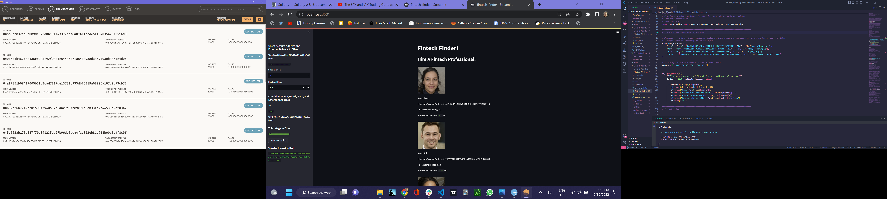
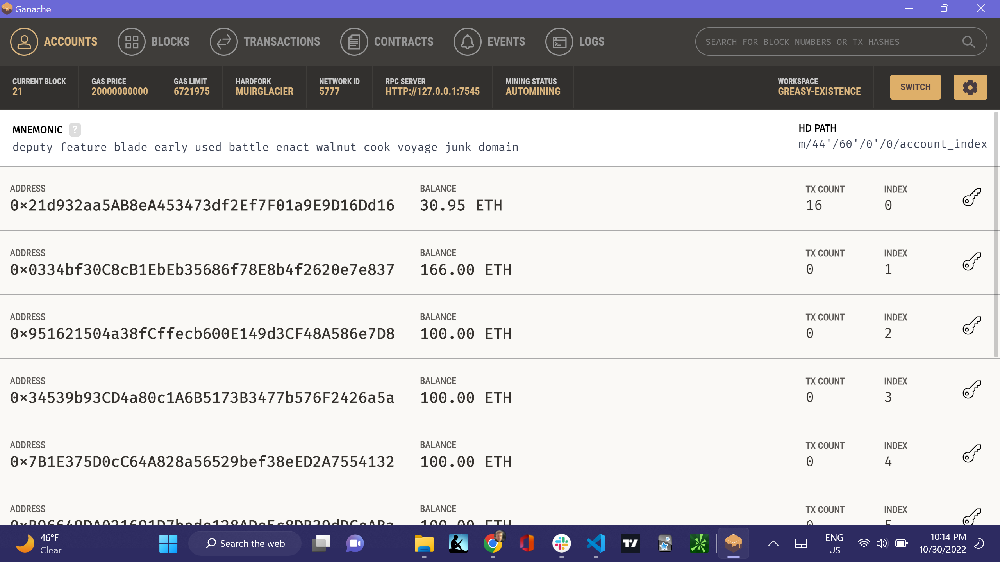

# Module_19_Challenge

I will assume the perspective of a Fintech Finder customer in order to do the following:

Generate a new Ethereum account instance by using your mnemonic seed phrase (which you created earlier in the module).

Fetch and display the account balance associated with your Ethereum account address.

Calculate the total value of an Ethereum transaction, including the gas estimate, that pays a Fintech Finder candidate for their work.

Digitally sign a transaction that pays a Fintech Finder candidate, and send this transaction to the Ganache blockchain.

Review the transaction hash code associated with the validated blockchain transaction.

Once I receive the transaction’s hash code, I will navigate to the Transactions section of Ganache to review the blockchain transaction details. To confirm that I have successfully created the transaction, I will save screenshots to the README.md file in my GitHub repository for this Challenge assignment.

## Technologies

I created it with a dev environment running 3.7.13. Pip install the following libraries and dependencies.

---

## Installation Guide

pip install </br>
pip install streamlit </br>
pip install dataclasses</br>
pip installtyping</br>
pip install web3</br>
pip install w3</br>

git clone https://github.com/JeffSmith-ok/Module_19_Challenge

cd Module_19_Challenge

Type the following command:

streamlit run fintech_finder.py

---

## Usage

The following image presents the code with the transaction processed in ganache and streamlit.

##  </br>

## 

## Contributors

This is the Module 19 Challenge.

My contact information is:

Name: Jeffrey M. Smith </br>
Linkedin: https://www.linkedin.com/in/jeffsmith77/ </br>
Personal email: jsmith@lexsmith.finance</br>

---

## License

MIT License

Copyright (c) 2022 Jeffrey M. Smith

Permission is hereby granted, free of charge, to any person obtaining a copy of this software and associated documentation files (the "Software"), to deal in the Software without restriction, including without limitation the rights to use, copy, modify, merge, publish, distribute, sublicense, and/or sell
copies of the Software, and to permit persons to whom the Software is furnished to do so, subject to the following conditions:

The above copyright notice and this permission notice shall be included in all copies or substantial portions of the Software.

THE SOFTWARE IS PROVIDED "AS IS", WITHOUT WARRANTY OF ANY KIND, EXPRESS OR IMPLIED, INCLUDING BUT NOT LIMITED TO THE WARRANTIES OF MERCHANTABILITY, FITNESS FOR A PARTICULAR PURPOSE AND NONINFRINGEMENT. IN NO EVENT SHALL THE AUTHORS OR COPYRIGHT HOLDERS BE LIABLE FOR ANY CLAIM, DAMAGES OR OTHER LIABILITY, WHETHER IN AN ACTION OF CONTRACT, TORT OR OTHERWISE, ARISING FROM, OUT OF OR IN CONNECTION WITH THE SOFTWARE OR THE USE OR OTHER DEALINGS IN THE
SOFTWARE.

```

```
